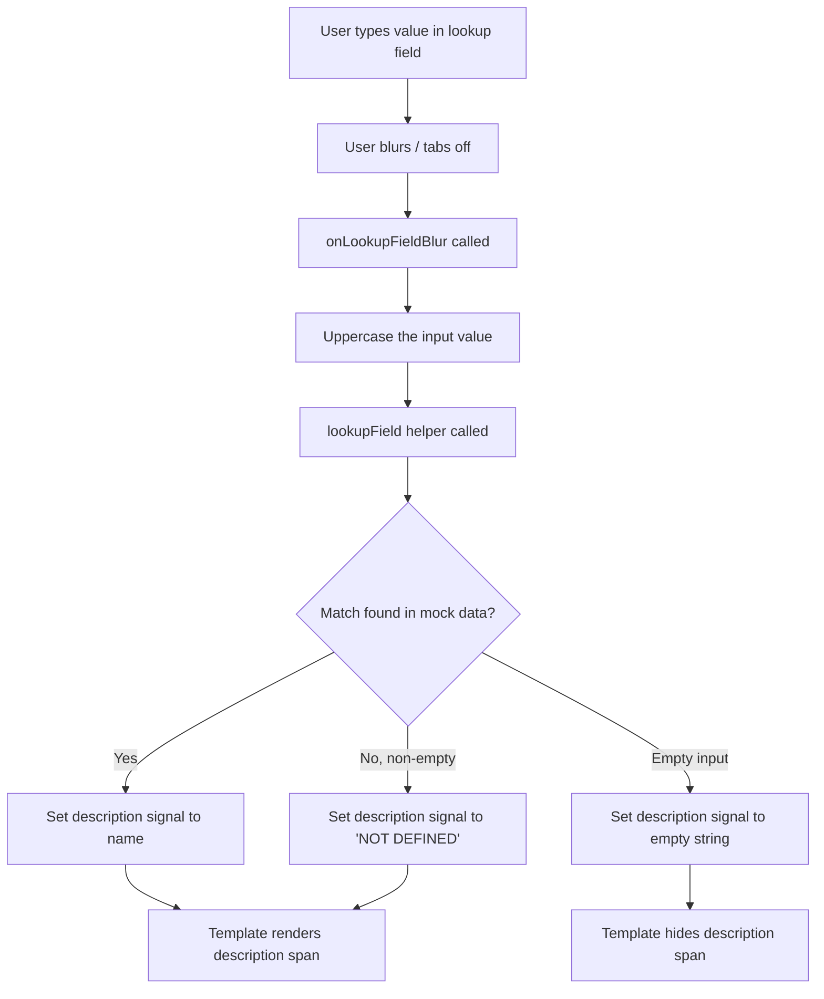
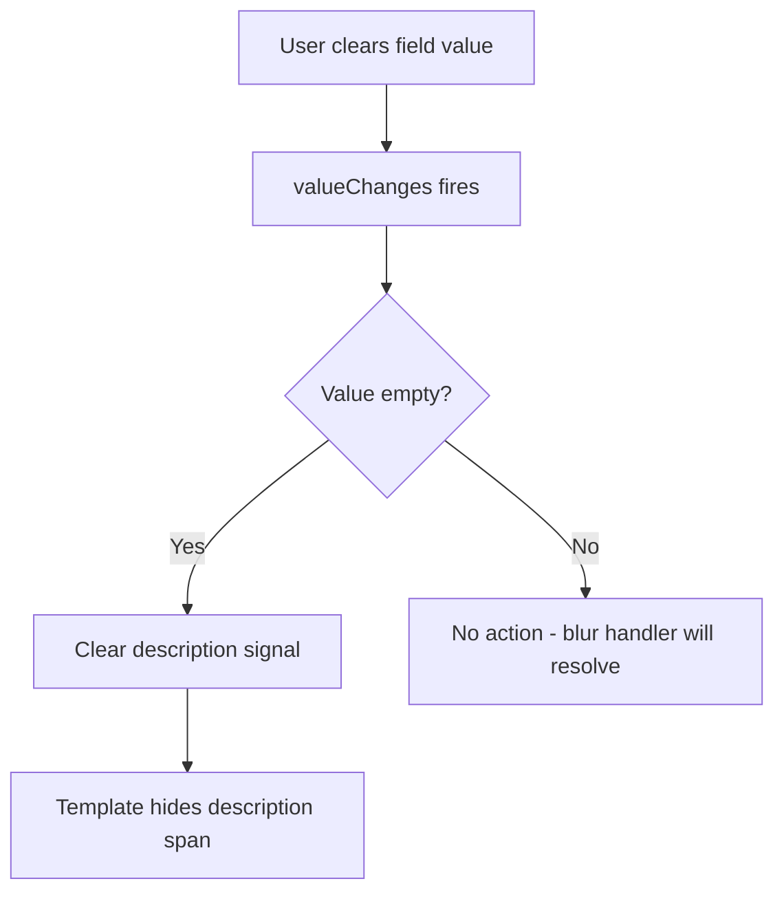

# Design Document: Lookup Field Descriptions

## Overview

This feature adds description text below all 13 lookup fields in the New Work Order form (`NewWorkOrderComponent`). When a user types a value and tabs off (blur), the field resolves the value against inline mock data and displays either the matching description or "NOT DEFINED" below the input. The input value is uppercased on blur. Descriptions clear when the field is emptied.

This is a port of the FE-528 lookup field descriptions feature, adapted for the New Work Order form which has 13 lookup fields across Repair, PM, Part Rebuild, and Linear Asset form variants. Key differences from FE-528:

- **13 fields** instead of 6 (Asset, Part ID, Equipment ID, Repair Reason, Work Class, Service Status, Repair Site, PM Service, Vendor, Contact Name, Priority, Financial Project Code, Account)
- **No multi-entry table mode** — single-entry form only
- **No MockDataService** — inline mock data arrays defined directly in the component
- **Asset data** comes from `assets.json` (loaded via fetch), not from a service signal
- **Some fields appear in multiple form variants** (e.g., Work Class in Repair, Linear, Part Rebuild; Service Status in Repair and Linear)
- **Form uses `woForm`** instead of `singleEntryForm`

### Design Decisions

1. **Single `lookupField()` helper** — One method handles all 13 field types via a switch statement. Takes `(fieldName, value)`, returns `{ text: string; isError: boolean }`. Case-insensitive match, trims input, empty → `{ text: '', isError: false }`, no match → `{ text: 'NOT DEFINED', isError: true }`.

2. **13 pairs of description signals** — Each lookup field gets `signal<string>('')` for text and `signal<boolean>(false)` for error state. This keeps the template reactive without triggering unnecessary change detection.

3. **Inline mock data arrays** — Each field's mock data is defined as a simple `readonly` array of `{ id: string; name: string }` objects directly in the component. No separate service or file needed.

4. **Asset special case** — Asset descriptions resolve against the loaded `assets.json` data. The asset data is fetched at startup and stored in a signal. The Asset Search Dialog selection also updates the description.

5. **`onLookupFieldBlur(fieldName)` handler** — Single blur handler reads the form value, calls `lookupField()`, sets the matching signal pair, and uppercases the input.

6. **`_watchLookupFieldClears()`** — Subscribes to `valueChanges` on all 13 lookup form controls and clears the description when the value becomes empty.

7. **`onLookupFieldInput(fieldName, event)` handler** — Fires on every native `(input)` event. When the input value is empty, immediately clears the description signals. This ensures the description disappears instantly when the user clicks the X clear button or select-all+deletes, without waiting for blur.

8. **Form row alignment change** — `.form-row` changes from `align-items: flex-end` to `align-items: flex-start` at the desktop breakpoint so that description text below one field doesn't misalign the adjacent field.

## Architecture

### Component Modification Strategy

All changes are confined to three files plus documentation:

```
new-work-order.component.ts   — Add lookup helper, mock data, description signals, blur handlers, clear watchers
new-work-order.component.html — Add (blur) bindings, description <span> elements below each lookup field
new-work-order.component.scss — Add .field-desc style, change .form-row alignment
```

Plus documentation updates:
```
MOCK-DATA-GUIDE.md — Document lookup field data sources and scenarios
README.md          — Document lookup field description behavior
```

### Data Flow



### Clear-on-Empty Flow



## Components and Interfaces

### Modified: `NewWorkOrderComponent`

#### Inline Mock Data Arrays

Each lookup field gets a simple readonly array. Asset data comes from `assets.json` instead.

```typescript
/** Mock data for Part ID lookup. */
private readonly _mockPartData: readonly { id: string; name: string }[] = [
  { id: 'PRT-001', name: 'Brake Pad Set' },
  { id: 'PRT-002', name: 'Oil Filter' },
  { id: 'PRT-003', name: 'Air Filter' },
];

/** Mock data for Equipment ID lookup. */
private readonly _mockEquipmentData: readonly { id: string; name: string }[] = [
  { id: 'EQ-001', name: 'Excavator CAT 320' },
  { id: 'EQ-002', name: 'Loader JD 544' },
];

/** Mock data for Repair Reason lookup. */
private readonly _mockRepairReasonData: readonly { id: string; name: string }[] = [
  { id: 'RR-001', name: 'Scheduled Maintenance' },
  { id: 'RR-002', name: 'Breakdown' },
  { id: 'RR-003', name: 'Accident Damage' },
];

/** Mock data for Work Class lookup. */
private readonly _mockWorkClassData: readonly { id: string; name: string }[] = [
  { id: 'WC-001', name: 'In-House Repair' },
  { id: 'WC-002', name: 'Outsourced' },
  { id: 'WC-003', name: 'Warranty' },
];

/** Mock data for Service Status lookup. */
private readonly _mockServiceStatusData: readonly { id: string; name: string }[] = [
  { id: 'SS-001', name: 'Open' },
  { id: 'SS-002', name: 'In Progress' },
  { id: 'SS-003', name: 'Completed' },
];

/** Mock data for Repair Site lookup. */
private readonly _mockRepairSiteData: readonly { id: string; name: string }[] = [
  { id: 'RS-001', name: 'Main Shop' },
  { id: 'RS-002', name: 'Field Service' },
  { id: 'RS-003', name: 'Vendor Shop' },
];

/** Mock data for PM Service lookup. */
private readonly _mockPmServiceData: readonly { id: string; name: string }[] = [
  { id: 'PM-001', name: 'Oil Change Service' },
  { id: 'PM-002', name: 'Brake Inspection' },
];

/** Mock data for Vendor lookup. */
private readonly _mockVendorData: readonly { id: string; name: string }[] = [
  { id: 'VND-001', name: 'AutoParts Inc.' },
  { id: 'VND-002', name: 'Fleet Services LLC' },
];

/** Mock data for Contact Name lookup. */
private readonly _mockContactData: readonly { id: string; name: string }[] = [
  { id: 'CN-001', name: 'Jane Doe' },
  { id: 'CN-002', name: 'Bob Wilson' },
];

/** Mock data for Priority lookup. */
private readonly _mockPriorityData: readonly { id: string; name: string }[] = [
  { id: '1', name: 'Emergency' },
  { id: '2', name: 'Urgent' },
  { id: '3', name: 'High' },
  { id: '4', name: 'Normal' },
  { id: '5', name: 'Low' },
];

/** Mock data for Financial Project Code lookup. */
private readonly _mockFpcData: readonly { id: string; name: string }[] = [
  { id: 'FPC-001', name: 'FY2026 Infrastructure' },
  { id: 'FPC-002', name: 'FY2026 Fleet Renewal' },
];

/** Mock data for Account lookup. */
private readonly _mockAccountData: readonly { id: string; name: string }[] = [
  { id: 'ACC-001', name: 'General Maintenance' },
  { id: 'ACC-002', name: 'Fleet Operations' },
];
```

Asset data is loaded from `assets.json` via fetch and stored in a signal:

```typescript
/** Loaded asset data from assets.json for lookup resolution. */
private readonly _assetData = signal<{ AssetId: string; Description: string }[]>([]);
```

#### Description Signals (13 fields × 2 signals = 26 signals)

```typescript
// Asset
public readonly assetDesc = signal<string>('');
public readonly assetDescError = signal<boolean>(false);

// Part ID
public readonly partIdDesc = signal<string>('');
public readonly partIdDescError = signal<boolean>(false);

// Equipment ID
public readonly equipmentIdDesc = signal<string>('');
public readonly equipmentIdDescError = signal<boolean>(false);

// Repair Reason
public readonly repairReasonDesc = signal<string>('');
public readonly repairReasonDescError = signal<boolean>(false);

// Work Class
public readonly workClassDesc = signal<string>('');
public readonly workClassDescError = signal<boolean>(false);

// Service Status
public readonly serviceStatusDesc = signal<string>('');
public readonly serviceStatusDescError = signal<boolean>(false);

// Repair Site
public readonly repairSiteDesc = signal<string>('');
public readonly repairSiteDescError = signal<boolean>(false);

// PM Service
public readonly pmServiceDesc = signal<string>('');
public readonly pmServiceDescError = signal<boolean>(false);

// Vendor
public readonly vendorDesc = signal<string>('');
public readonly vendorDescError = signal<boolean>(false);

// Contact Name
public readonly contactNameDesc = signal<string>('');
public readonly contactNameDescError = signal<boolean>(false);

// Priority
public readonly priorityDesc = signal<string>('');
public readonly priorityDescError = signal<boolean>(false);

// Financial Project Code
public readonly financialProjectCodeDesc = signal<string>('');
public readonly financialProjectCodeDescError = signal<boolean>(false);

// Account
public readonly accountDesc = signal<string>('');
public readonly accountDescError = signal<boolean>(false);
```

#### New Method: `lookupField()`

```typescript
/**
 * Resolve a lookup field value against mock data.
 * Returns { text: description, isError: boolean }.
 * - Match found → { text: name/description, isError: false }
 * - No match, non-empty → { text: 'NOT DEFINED', isError: true }
 * - Empty/whitespace input → { text: '', isError: false }
 */
public lookupField(fieldName: string, value: string): { text: string; isError: boolean } {
  const trimmed = (value ?? '').trim();
  if (!trimmed) return { text: '', isError: false };

  const lower = trimmed.toLowerCase();

  switch (fieldName) {
    case 'asset': {
      const match = this._assetData().find(a => a.AssetId.toLowerCase() === lower);
      return match
        ? { text: match.Description, isError: false }
        : { text: 'NOT DEFINED', isError: true };
    }
    case 'partId': {
      const match = this._mockPartData.find(p => p.id.toLowerCase() === lower);
      return match ? { text: match.name, isError: false } : { text: 'NOT DEFINED', isError: true };
    }
    case 'equipmentId': {
      const match = this._mockEquipmentData.find(e => e.id.toLowerCase() === lower);
      return match ? { text: match.name, isError: false } : { text: 'NOT DEFINED', isError: true };
    }
    case 'repairReason': {
      const match = this._mockRepairReasonData.find(r => r.id.toLowerCase() === lower);
      return match ? { text: match.name, isError: false } : { text: 'NOT DEFINED', isError: true };
    }
    case 'workClass': {
      const match = this._mockWorkClassData.find(w => w.id.toLowerCase() === lower);
      return match ? { text: match.name, isError: false } : { text: 'NOT DEFINED', isError: true };
    }
    case 'serviceStatus': {
      const match = this._mockServiceStatusData.find(s => s.id.toLowerCase() === lower);
      return match ? { text: match.name, isError: false } : { text: 'NOT DEFINED', isError: true };
    }
    case 'repairSite': {
      const match = this._mockRepairSiteData.find(r => r.id.toLowerCase() === lower);
      return match ? { text: match.name, isError: false } : { text: 'NOT DEFINED', isError: true };
    }
    case 'pmService': {
      const match = this._mockPmServiceData.find(p => p.id.toLowerCase() === lower);
      return match ? { text: match.name, isError: false } : { text: 'NOT DEFINED', isError: true };
    }
    case 'vendor': {
      const match = this._mockVendorData.find(v => v.id.toLowerCase() === lower);
      return match ? { text: match.name, isError: false } : { text: 'NOT DEFINED', isError: true };
    }
    case 'contactName': {
      const match = this._mockContactData.find(c => c.id.toLowerCase() === lower);
      return match ? { text: match.name, isError: false } : { text: 'NOT DEFINED', isError: true };
    }
    case 'priority': {
      const match = this._mockPriorityData.find(p => p.id.toLowerCase() === lower);
      return match ? { text: match.name, isError: false } : { text: 'NOT DEFINED', isError: true };
    }
    case 'financialProjectCode': {
      const match = this._mockFpcData.find(f => f.id.toLowerCase() === lower);
      return match ? { text: match.name, isError: false } : { text: 'NOT DEFINED', isError: true };
    }
    case 'account': {
      const match = this._mockAccountData.find(a => a.id.toLowerCase() === lower);
      return match ? { text: match.name, isError: false } : { text: 'NOT DEFINED', isError: true };
    }
    default:
      return { text: '', isError: false };
  }
}
```

#### New Method: `onLookupFieldBlur(fieldName)`

Single blur handler for all 13 lookup fields:

```typescript
/**
 * Handle blur on any lookup field.
 * Reads form value, uppercases it, calls lookupField(), sets the matching signal pair.
 */
public onLookupFieldBlur(fieldName: string): void {
  const control = this.woForm.get(fieldName);
  const rawValue = (control?.value ?? '').toString();
  const trimmed = rawValue.trim();

  // Uppercase on blur (non-empty values only)
  if (trimmed) {
    control?.setValue(trimmed.toUpperCase(), { emitEvent: false });
  }

  const result = this.lookupField(fieldName, trimmed);

  // Set the matching signal pair
  switch (fieldName) {
    case 'asset':              this.assetDesc.set(result.text); this.assetDescError.set(result.isError); break;
    case 'partId':             this.partIdDesc.set(result.text); this.partIdDescError.set(result.isError); break;
    case 'equipmentId':        this.equipmentIdDesc.set(result.text); this.equipmentIdDescError.set(result.isError); break;
    case 'repairReason':       this.repairReasonDesc.set(result.text); this.repairReasonDescError.set(result.isError); break;
    case 'workClass':          this.workClassDesc.set(result.text); this.workClassDescError.set(result.isError); break;
    case 'serviceStatus':      this.serviceStatusDesc.set(result.text); this.serviceStatusDescError.set(result.isError); break;
    case 'repairSite':         this.repairSiteDesc.set(result.text); this.repairSiteDescError.set(result.isError); break;
    case 'pmService':          this.pmServiceDesc.set(result.text); this.pmServiceDescError.set(result.isError); break;
    case 'vendor':             this.vendorDesc.set(result.text); this.vendorDescError.set(result.isError); break;
    case 'contactName':        this.contactNameDesc.set(result.text); this.contactNameDescError.set(result.isError); break;
    case 'priority':           this.priorityDesc.set(result.text); this.priorityDescError.set(result.isError); break;
    case 'financialProjectCode': this.financialProjectCodeDesc.set(result.text); this.financialProjectCodeDescError.set(result.isError); break;
    case 'account':            this.accountDesc.set(result.text); this.accountDescError.set(result.isError); break;
  }
}
```

#### New Method: `_watchLookupFieldClears()`

Called in the constructor. Subscribes to `valueChanges` on all 13 lookup form controls and clears the description when the value becomes empty:

```typescript
/**
 * Subscribe to valueChanges on all lookup fields.
 * When a field value becomes empty, clear its description signals.
 */
private _watchLookupFieldClears(): void {
  const fieldSignalMap: Record<string, { desc: WritableSignal<string>; error: WritableSignal<boolean> }> = {
    asset:                { desc: this.assetDesc, error: this.assetDescError },
    partId:               { desc: this.partIdDesc, error: this.partIdDescError },
    equipmentId:          { desc: this.equipmentIdDesc, error: this.equipmentIdDescError },
    repairReason:         { desc: this.repairReasonDesc, error: this.repairReasonDescError },
    workClass:            { desc: this.workClassDesc, error: this.workClassDescError },
    serviceStatus:        { desc: this.serviceStatusDesc, error: this.serviceStatusDescError },
    repairSite:           { desc: this.repairSiteDesc, error: this.repairSiteDescError },
    pmService:            { desc: this.pmServiceDesc, error: this.pmServiceDescError },
    vendor:               { desc: this.vendorDesc, error: this.vendorDescError },
    contactName:          { desc: this.contactNameDesc, error: this.contactNameDescError },
    priority:             { desc: this.priorityDesc, error: this.priorityDescError },
    financialProjectCode: { desc: this.financialProjectCodeDesc, error: this.financialProjectCodeDescError },
    account:              { desc: this.accountDesc, error: this.accountDescError },
  };

  for (const [fieldName, signals] of Object.entries(fieldSignalMap)) {
    this.woForm.get(fieldName)?.valueChanges.subscribe(value => {
      if (!value || (typeof value === 'string' && value.trim() === '')) {
        signals.desc.set('');
        signals.error.set(false);
      }
    });
  }
}
```

#### Modified: `openAssetSearchDialog()` — Asset Description on Dialog Selection

After setting the asset value from dialog selection, also update the asset description signals:

```typescript
// Inside the dialog result callback, after setting the asset value:
const assetResult = this.lookupField('asset', asset.AssetId);
this.assetDesc.set(assetResult.text);
this.assetDescError.set(assetResult.isError);
```

#### New Method: `onLookupFieldInput(fieldName, event)`

Fires on every native `(input)` event. Clears description immediately when the input value is empty:

```typescript
/**
 * Clear description immediately when a lookup field input is emptied (e.g., X button, select-all+delete).
 * Fires on native (input) event for instant feedback without waiting for blur.
 */
public onLookupFieldInput(fieldName: string, event: Event): void {
  const value = (event.target as HTMLInputElement)?.value ?? '';
  if (!value.trim()) {
    const fieldSignalMap: Record<string, { desc: WritableSignal<string>; error: WritableSignal<boolean> }> = {
      asset:                { desc: this.assetDesc, error: this.assetDescError },
      partId:               { desc: this.partIdDesc, error: this.partIdDescError },
      equipmentId:          { desc: this.equipmentIdDesc, error: this.equipmentIdDescError },
      repairReason:         { desc: this.repairReasonDesc, error: this.repairReasonDescError },
      workClass:            { desc: this.workClassDesc, error: this.workClassDescError },
      serviceStatus:        { desc: this.serviceStatusDesc, error: this.serviceStatusDescError },
      repairSite:           { desc: this.repairSiteDesc, error: this.repairSiteDescError },
      pmService:            { desc: this.pmServiceDesc, error: this.pmServiceDescError },
      vendor:               { desc: this.vendorDesc, error: this.vendorDescError },
      contactName:          { desc: this.contactNameDesc, error: this.contactNameDescError },
      priority:             { desc: this.priorityDesc, error: this.priorityDescError },
      financialProjectCode: { desc: this.financialProjectCodeDesc, error: this.financialProjectCodeDescError },
      account:              { desc: this.accountDesc, error: this.accountDescError },
    };
    const signals = fieldSignalMap[fieldName];
    if (signals) {
      signals.desc.set('');
      signals.error.set(false);
    }
  }
}
```

### Modified: `new-work-order.component.html`

Each lookup field gets a `(blur)` binding and a description `<span>` below the `field-with-icon` div, inside the `.form-field` div:

```html
<!-- Example: Account field -->
<div class="form-field">
  <aw-form-field-label>Account</aw-form-field-label>
  <div class="field-with-icon">
    <aw-form-field>
      <input AwInput formControlName="account" aria-label="Account"
        (blur)="onLookupFieldBlur('account')" (input)="onLookupFieldInput('account', $event)" />
    </aw-form-field>
    <button AwButtonIconOnly [buttonType]="'primary'" ariaLabel="Search Account" (click)="onLookup('account')">
      <aw-icon [iconName]="'search'" [iconColor]="''"></aw-icon>
    </button>
  </div>
  @if (accountDesc()) {
    <span class="aw-c-1 field-desc">{{ accountDesc() }}</span>
  }
</div>
```

**Note on duplicate fields:** Work Class, Service Status, and Repair Reason appear in multiple form variants (Repair meters section, Linear work details section, Part Rebuild section). All instances share the same form control and description signals, so the `(blur)` binding and `@if` span are added to every instance.

### Modified: `new-work-order.component.scss`

```scss
/* Description text below lookup fields */
.field-desc {
  display: block;
  color: var(--system-text-text-secondary, #5b6670);
  margin-left: 2px;
}
```

And change `.form-row` alignment at desktop breakpoint:

```scss
.form-row {
  /* ... existing styles ... */
  @media (min-width: 768px) {
    flex-direction: row;
    gap: 24px;
    align-items: flex-start;  /* Changed from flex-end */
  }
}
```

## Data Models

### No New Data Models

All data is simple inline arrays of `{ id: string; name: string }` objects. No new interfaces or types are needed — the shape is used directly.

### Mock Data Sources for Lookup

| Field | Data Source | Match Key | Display Value |
|-------|-----------|-----------|---------------|
| Asset | `_assetData` signal (from `assets.json`) | `AssetId` | `Description` |
| Part ID | `_mockPartData` inline array | `id` | `name` |
| Equipment ID | `_mockEquipmentData` inline array | `id` | `name` |
| Repair Reason | `_mockRepairReasonData` inline array | `id` | `name` |
| Work Class | `_mockWorkClassData` inline array | `id` | `name` |
| Service Status | `_mockServiceStatusData` inline array | `id` | `name` |
| Repair Site | `_mockRepairSiteData` inline array | `id` | `name` |
| PM Service | `_mockPmServiceData` inline array | `id` | `name` |
| Vendor | `_mockVendorData` inline array | `id` | `name` |
| Contact Name | `_mockContactData` inline array | `id` | `name` |
| Priority | `_mockPriorityData` inline array | `id` | `name` |
| Financial Project Code | `_mockFpcData` inline array | `id` | `name` |
| Account | `_mockAccountData` inline array | `id` | `name` |


## Correctness Properties

*A property is a characteristic or behavior that should hold true across all valid executions of a system — essentially, a formal statement about what the system should do. Properties serve as the bridge between human-readable specifications and machine-verifiable correctness guarantees.*

### Property 1: Lookup returns correct description for valid IDs

*For any* lookup field type (asset, partId, equipmentId, repairReason, workClass, serviceStatus, repairSite, pmService, vendor, contactName, priority, financialProjectCode, account) and *for any* valid ID that exists in that field's mock data source, calling `lookupField(fieldType, validId)` SHALL return `{ text: <the corresponding name/description>, isError: false }`.

**Validates: Requirements 1.1, 2.1, 3.1, 4.1, 5.1, 6.1, 7.1, 8.1, 9.1, 10.1, 11.1, 12.1, 13.1**

### Property 2: Lookup is case-insensitive

*For any* lookup field type and *for any* valid ID in that field's mock data source, calling `lookupField(fieldType, id)` SHALL return the same description regardless of the casing of the input (uppercase, lowercase, mixed case).

**Validates: Requirements 1.1, 2.1, 3.1, 4.1, 5.1, 6.1, 7.1, 8.1, 9.1, 10.1, 11.1, 12.1, 13.1**

### Property 3: Lookup returns "NOT DEFINED" for invalid non-empty inputs

*For any* lookup field type and *for any* non-empty string that does NOT match any ID in that field's mock data source, calling `lookupField(fieldType, invalidValue)` SHALL return `{ text: 'NOT DEFINED', isError: true }`.

**Validates: Requirements 1.3, 2.3, 3.3, 4.3, 5.3, 6.3, 7.3, 8.3, 9.3, 10.3, 11.3, 12.3, 13.3**

### Property 4: Lookup returns empty for empty/whitespace input

*For any* lookup field type and *for any* string composed entirely of whitespace (including the empty string), calling `lookupField(fieldType, whitespaceString)` SHALL return `{ text: '', isError: false }`.

**Validates: Requirements 1.4, 1.5, 2.4, 2.5, 3.4, 3.5, 4.4, 4.5, 5.4, 5.5, 6.4, 6.5, 7.4, 7.5, 8.4, 8.5, 9.4, 9.5, 10.4, 10.5, 11.4, 11.5, 12.4, 12.5, 13.4, 13.5**

## Error Handling

### Lookup Failures

The `lookupField()` function is a pure in-memory operation against inline mock data arrays — no network calls, no async operations. Errors are not expected. If a mock data array is somehow empty, the lookup will return "NOT DEFINED" for any input, which is the correct degraded behavior.

### Asset Data Loading

Asset data is loaded from `assets.json` via fetch. If the fetch fails, the `_assetData` signal remains empty, and all asset lookups will return "NOT DEFINED". This is acceptable for a harness application.

### Edge Cases

| Scenario | Behavior |
|----------|----------|
| Field value is `null` or `undefined` | Treated as empty — description hidden |
| Field value is whitespace only | Treated as empty — description hidden |
| Mock data array is empty | All lookups return "NOT DEFINED" |
| Asset selected via dialog then manually edited | Blur handler re-evaluates the new value |
| Field appears in multiple form variants | Same form control and signals — description stays consistent |
| Default form values (e.g., `(R-12345) MOTOR POOL SEDAN`) | Won't match asset ID format — shows "NOT DEFINED" on blur (expected; dialog selection sets the correct description) |

## Testing Strategy

### Checkpoint 1: Core Lookup + First 6 Fields

Manual testing scenarios:
1. Type `ACC-001` in Account field, tab off → "General Maintenance" appears below, input uppercased
2. Type `invalid` in Account field, tab off → "NOT DEFINED" appears below, input uppercased to "INVALID"
3. Clear Account field → description disappears
4. Type `fpc-001` in Financial Project Code, tab off → "FY2026 Infrastructure" appears (case-insensitive)
5. Select asset via dialog → description appears below Asset field
6. Repeat for Priority, Vendor, Contact Name, Part ID, Equipment ID

### Checkpoint 2: Remaining Fields + Layout

Manual testing scenarios:
1. Select Repair job type, type `RR-001` in Repair Reason, tab off → "Scheduled Maintenance" appears
2. Type `WC-002` in Work Class, tab off → "Outsourced" appears
3. Type `SS-001` in Service Status, tab off → "Open" appears
4. Type `RS-003` in Repair Site, tab off → "Vendor Shop" appears
5. Switch to PM + Linear, type `PM-001` in PM Service, tab off → "Oil Change Service" appears
6. Verify form row alignment — description below one field doesn't misalign adjacent field
7. Switch to Part Rebuild, verify Work Class description works in that variant too

### Property-Based Testing

This feature is suitable for property-based testing because the core `lookupField()` function is a pure function with clear input/output behavior and a meaningful input space (13 field types × string values).

**Library:** Jasmine loops (100 iterations per property) — per project testing guidelines.

**Configuration:**
- Minimum 100 iterations per property test
- Each test references its design document property
- Tag format: `Feature: lookup-field-descriptions, Property N: <property text>`

**Test approach:**
- Generate random field types from the set of 13 lookup fields
- Generate random strings (mix of valid IDs from mock data and random gibberish)
- Generate random case variations of valid IDs
- Generate random whitespace strings
- Verify the `lookupField()` return value matches the expected property

### Unit Tests (Example-Based)

- Verify description `<span>` appears with correct CSS classes (`aw-c-1`, `field-desc`)
- Verify description `<span>` uses `text-secondary` color
- Verify dialog selection updates description signals (Asset)
- Verify `_watchLookupFieldClears()` clears description when field value becomes empty
- Verify uppercase on blur sets form control value to uppercase
- Verify `.form-row` uses `align-items: flex-start` at desktop breakpoint
